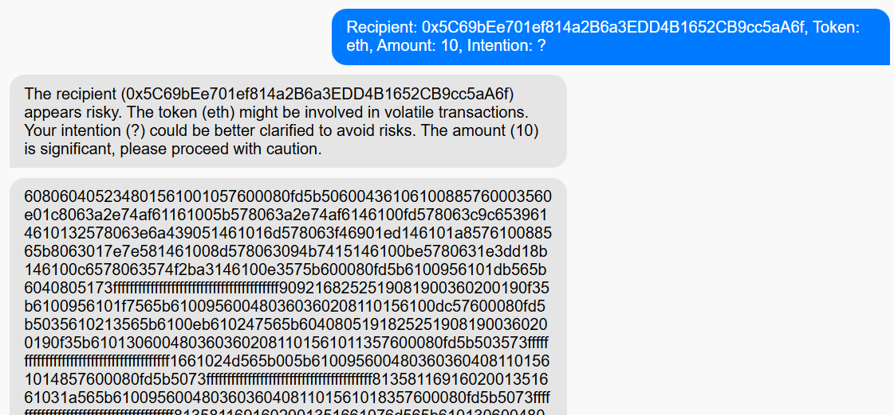

# Page frame prototype

## 11.24 - zilng
There's no actual ai, just repeating what user sent.

## 12.1 - ziling
add funtion: now page can fetch smart contract bytecode from recipient. information stored in bytecode.
