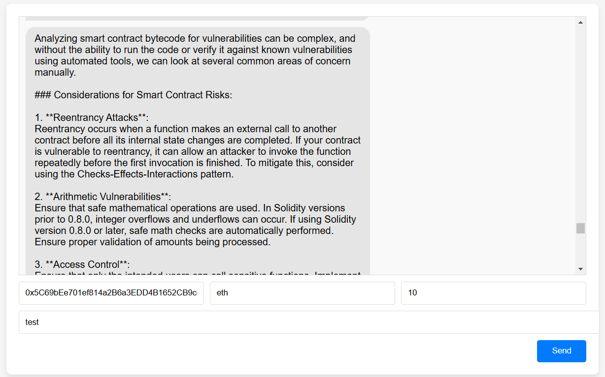
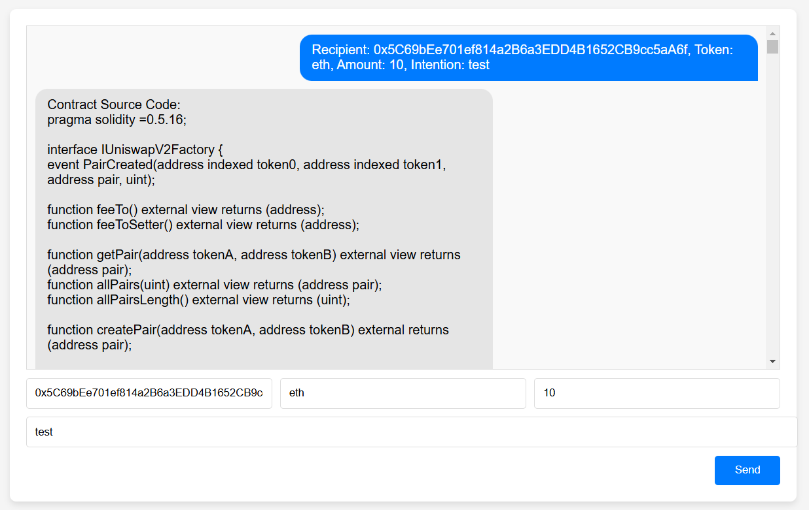
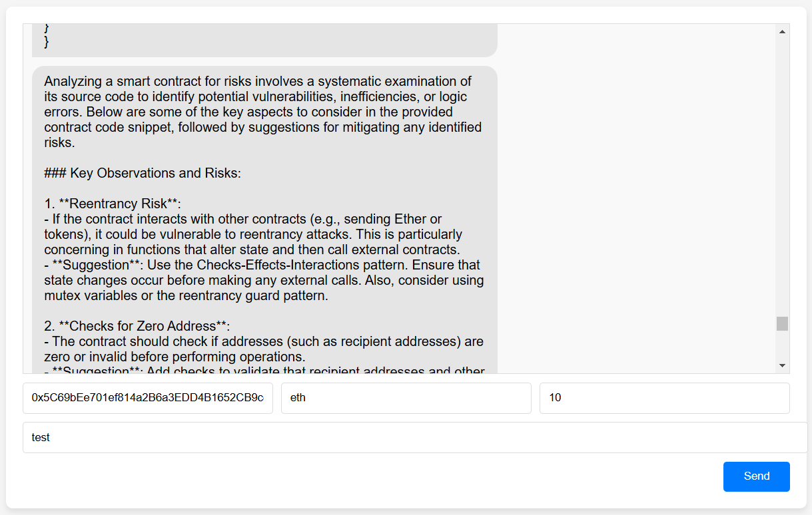
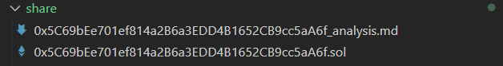
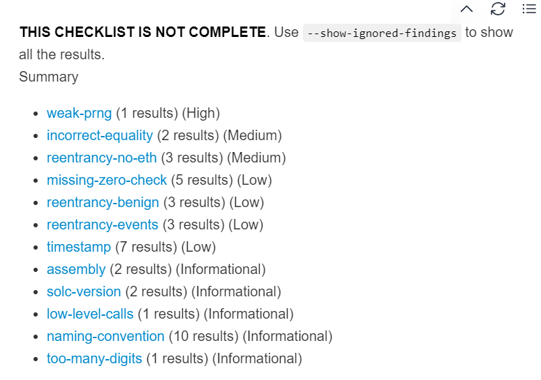

# Page frame prototype

## 11.24 - zilng
There's no actual ai, just repeating what user sent.

## 12.1 - ziling
add funtion: now page can fetch smart contract bytecode from recipient. information stored in bytecode.

## 12.9 - ziling
add function: now this page can connect with gpt model. audit keeper will answer bytecode of addr and gpt response seperately but gpt will take time for several seconds.

## 12.10 - ziling
add function: now replace bytecode with source code and prompts, but response from gpt is not satisfying.

## 12.27 - ziling
add function: connect with local docker, using slither to detect vulnerabilities and save output as md. 
Prerequisite: local docker desktop and slither, container using same version of solc with the smart contract.
### sample:

